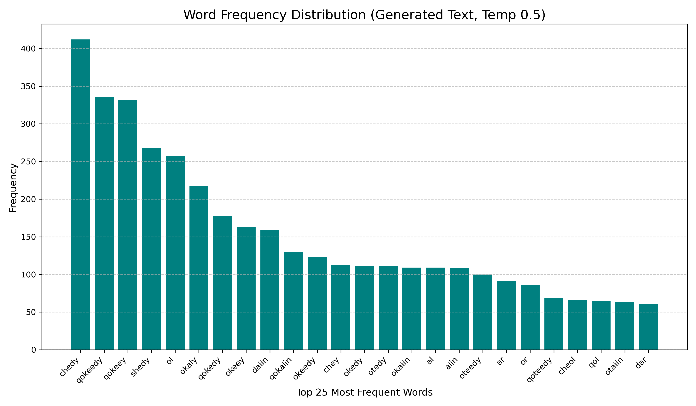
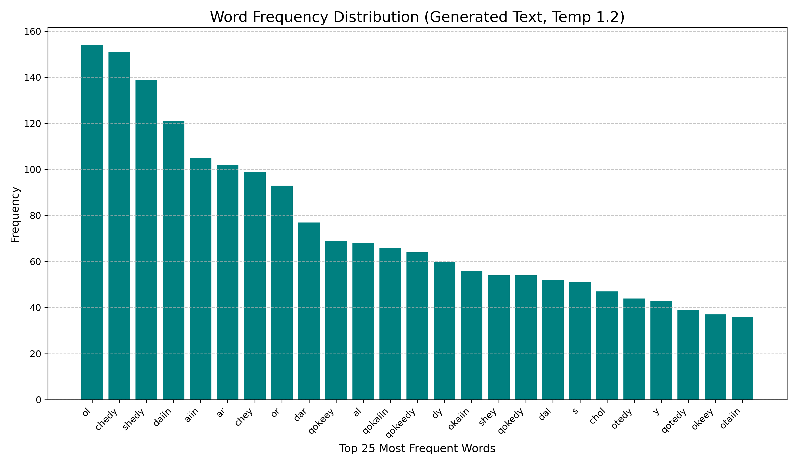

# Experimental Verification of the Voynich Manuscript's Artificial Language Hypothesis


This repository contains the code, data, and results of a computational study on the nature of the Voynich Manuscript's language (MS 408). This project uses a generative LSTM model to experimentally test the hypothesis that the manuscript's text is an artificial, algorithm-based artifact rather than a natural language.

**Link to the full paper:** `[Coming Soon]`

---

## Project Abstract

This study trains a recurrent neural network (LSTM) on a "super-clean" version of the manuscript's corpus to learn its structural rules. The trained model is then used to generate new text under controlled conditions by varying the "temperature" (creativity) parameter.

A quantitative analysis of the generated text, compared to the original, reveals that the model replicates the manuscript's statistical anomalies with exceptional fidelity. The most compelling finding is the model's handling of the text's rigid positional grammar (specific glyphs for starting vs. ending words). This core rule proved to be remarkably robust, holding true even when the model was pushed into a high-temperature state of statistical chaos. This behavior —perfect and unshakable adherence to an unnatural rule under all conditions— is characteristic of a precisely engineered algorithmic system, not a flexible, naturally evolved language.

## Key Findings & Visual Evidence

* **Normal Temperature (0.7):** The model generates text that is statistically almost indistinguishable from the original, perfectly replicating its positional grammar and entropy (`3.7381` vs. original `3.8639`).
    * **Original Clean Text:**
        
    * **Generated Normal Temp Text:**
        

* **Low Temperature (0.5):** The model produces a more repetitive but grammatically perfect text. The data cleaning resolved previous experimental artifacts (like unnaturally long words), confirming the model's stability. The positional rule remains flawless.
    * **Generated Low Temp Text:**
        

* **High Temperature (1.2) - The "Smoking Gun":** This was the most crucial test. We hypothesized that statistical chaos would "break" the artificial rules. Instead, we found something more profound:
    * The text became more varied, but the entropy (`3.8640`) remained **almost identical** to the original manuscript's, showing the system's incredible statistical stability.
    * Most importantly, even in this chaotic state, the **fundamental positional rule DID NOT BREAK**. The sets of starting and ending characters remained perfectly distinct and consistent with the original. This demonstrates that the rule is not a mere statistical trend but an inviolable, core law of the generative algorithm.
    * **Generated High Temp Text:**
        

---

## Repository Structure

* `analyze_voynich.py`: Python script to perform the full statistical analysis on any text file.
* `training_and_generation.ipynb`: The Google Colab notebook for training the LSTM model and generating the new texts.
* `deep_cleaning_voynich.py`: The script used to perform the deep clean on the original transcription file.
* `voynich.txt`: The original transcription file used as input for the cleaning script.
* `requirements.txt`: The required Python libraries to run the analysis.
* `training_checkpoints.zip`: The saved weights of the trained LSTM model.
* `/data/`: Contains the clean training corpus and the three generated texts.
* `/charts/`: Contains the output charts from the analysis.

## How to Replicate the Experiment

1.  **Clone the repository:**
    ```bash
    git clone [https://github.com/](https://github.com/)[GSimonin90]/voynich-generative-analysis.git
    ```
2.  **Set up the environment:**
    ```bash
    cd voynich-generative-analysis
    python -m venv .venv
    .\.venv\Scripts\Activate
    pip install -r requirements.txt
    ```
3.  **Run the analysis:** The `analyze_voynich.py` script will analyze all four key text files and generate the charts.
4.  **Re-train the model (Optional):** Open `training_and_generation.ipynb` in Google Colab, upload the `data/voynich_super_clean.txt` file, and run the cells in order.

---

## Acknowledgements

This study was conducted in close collaboration with Gemini, a large language model from Google. The human author defined the research hypothesis and goals, directed the experimental phases, executed the code, and interpreted the results. Gemini served as an advanced tool for Python code generation and the structuring of this research documentation.

---

## License

This project is licensed under the MIT License.
